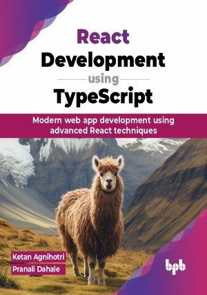

# React Development using TypeScript

Gain expertise in React, Hooks, Redux, React Router, Next.js, Best Practices, and much more

This is the repository for [React Development using TypeScript
](https://bpbonline.com/products/react-development-using-typescript),published by BPB Publications.

## About the Book
React is great for building interfaces, and TypeScript adds typing and better tools. React development using TypeScript is a complete guide that combines React and TypeScript to help you become a skilled React developer.

It covers React basics, JSX syntax, and essential JavaScript features. You will learn about component state management with hooks like useState and useEffect, handling user interactions, and using Axios for REST API integration. It includes unit testing with Jest and React Testing Library and explores Redux for state management. Learn optimization strategies and use Next.js for server-side rendering. Bonus content includes React Native for mobile apps and integrating React with GraphQL. This book also covers advanced features like Concurrent Mode, Suspense, and React Server Components.

By the end of this book, you will be equipped to confidently build modern, interactive web applications using React and TypeScript. You will not only understand core React concepts but also have the skills to tackle complex state management with Redux and explore advanced features like server-side rendering with Next.js.

## What You Will Learn
• Learn core React concepts and understand the benefits of TypeScript in React development.

• Grasp fundamental JavaScript concepts like variables, data types, and functions.

• Integrate React applications with REST APIs using Axios.

• Build user interfaces with React Native components.

• Optimize React application performance using memoization and profiling tools.
